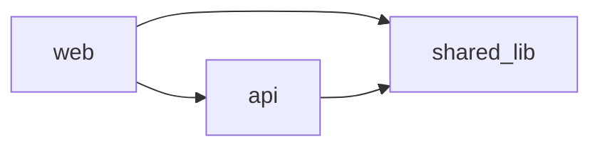

# Workspace Map Template (L0 — multi-repo only)

Template for the cross-repo map ADAS persists at `.adas-workspace/context/workspace-map.md`. Generated only for **polyrepo** workspaces (multiple independent repos in one multi-root workspace). The workspace coordinator agent reads this to plan and auto-delegate.

## Rules

- One row per repo; one edge per detected cross-repo dependency or shared contract.
- Detect relationships **language-agnostically**: shared packages, OpenAPI/proto specs, env base-URLs, manifest references, resolved imports.
- The mermaid graph is the centerpiece — it *is* a graph, so always include it.
- Each repo keeps its own `.github/adas/context.md` (L1); this file only captures the *between-repos* layer.

## `.adas-workspace/context/workspace-map.md`

```markdown
# Workspace Map

## Repos
| Repo | Role | Stack | Standalone .github/ |
|------|------|-------|---------------------|
| {api} | {backend service} | {stack} | yes |
| {web} | {frontend} | {stack} | yes |
| {shared-lib} | {shared contracts/types} | {stack} | yes |

## Cross-Repo Dependencies


## Contracts (the integration surface)
| Producer | Consumer(s) | Contract | Location |
|----------|-------------|----------|----------|
| {api} | {web} | REST/OpenAPI | {path or url} |
| {shared-lib} | {api, web} | types/schema | {package name} |

## Delegation Order
> When a change spans repos, follow contract direction (producers before consumers).
1. {shared-lib} (contracts) → 2. {api} (producer) → 3. {web} (consumer)

## Guardrails (workspace-wide)
- Each specialist is path-confined to its own repo.
- No agent commits — work ends at a dirty working tree (see hooks).

## Scan Metadata
- Repos detected: {n}
- Topology: polyrepo
- Scanned: {ISO date}
```

## Generation notes

1. Generated into `.adas-workspace/`, which is itself added as a workspace folder so VS Code discovers its `.github/agents` and `.github/hooks`.
2. The `workspace-coordinator.agent.md` `agents:` allowlist must list every per-repo specialist it may delegate to (cross-folder).
3. Delegation Order seeds the coordinator's planning so interdependent repos are handled producer-first.
