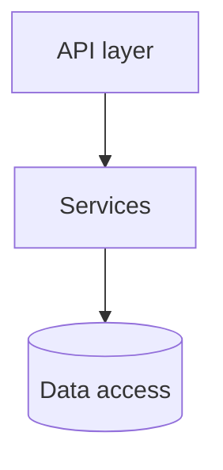
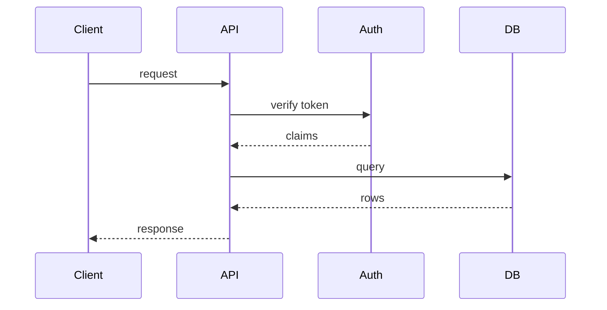

# Repository Analysis

Perform a comprehensive analysis of a target repo or workspace to produce **durable, agent-friendly context** that drives Copilot customization generation.

## When to Use

- Scanning a repo (or polyrepo workspace) before generating Copilot agent configs
- Re-scanning for incremental updates
- Understanding structure, conventions, capabilities, and cross-repo relationships

## Output Philosophy — Agent-Friendly Context

The scan is not an ephemeral dump; it becomes a **persisted artifact** (`context.md`) that generated agents read as grounding. Therefore:

- Use **stable headings** (the L1 contract below) so agents parse deterministically.
- Use **mermaid selectively** — draw a diagram only where the information *is* a graph (architecture, key flows, build pipeline, cross-repo deps). Keep flat facts (commands, conventions) as tables/text.
- Record **capabilities** explicitly — they drive which agents/skills/instructions get generated.
- **Real values only** — `None detected` when absent; never invent.

## Procedure

### Step 0 — Workspace Topology

Determine the topology before scanning content:
- **Single repo** — one repo in the workspace.
- **Monorepo** — one git repo with multiple packages (`turbo.json`, `nx.json`, `pnpm-workspace.yaml`, `lerna.json`, or `packages/`+`apps/` with multiple manifests).
- **Polyrepo** — multiple independent git repos as separate multi-root workspace folders.

For polyrepo, scan **each repo** (L1) and then derive the **workspace map** (L0) with cross-repo contracts.

### Step 1 — Identify the Target(s)

Confirm each target repo root (not the ADAS repo itself). Verify each contains source files.

### Step 2 — Run Analysis Categories (per repo)

Follow the [analysis checklist](./references/analysis-checklist.md):

1. **Tech Stack** — languages, frameworks, package managers, key deps
2. **Code Conventions** — naming, architecture, error handling, patterns
3. **Build/Test/Deploy** — exact commands, CI/CD, containers, deploy targets
4. **Documentation** — README, CONTRIBUTING, docs/, ADRs, changelogs
5. **Git History** — commit/branch conventions, hotspots, PR templates
6. **Existing Agent Configs** — Copilot/Cursor/Claude/Windsurf files
7. **Security & Policy** — auth, secrets, env handling
8. **Capabilities & Complexity** — test-runner / formatter / ci / api / ui / db presence; file count; tier
9. **Cross-Repo (polyrepo/monorepo only)** — shared packages, OpenAPI/proto specs, env base-URLs, manifest references, resolved imports → contract surface and dependency direction

### Step 3 — Compile L1 Context (per repo)

Emit the persisted artifact using the **stable L1 contract** (matches [context templates](../copilot-generation/references/context-templates.md)):

```markdown
# Repo Context: {name}
## Summary
## Tech Stack            (table)
## Commands              (install/build/test/lint/run — exact)
## Conventions           (naming/architecture/error-handling)
## Architecture          (2–4 sentences + flowchart mermaid IF modules have real deps)
## Key Flows             (optional sequenceDiagram for primary request/auth/data flow)
## Capabilities          (test-runner / formatter / ci / api / ui / db — detected or None)
## Entry Points
## Docs                  (links only)
## Scan Metadata         (file count, complexity tier, scan date, commit)
```

Mermaid examples:





### Step 4 — Compile L0 Workspace Map (polyrepo only)

Emit the cross-repo map (matches [workspace map template](../copilot-generation/references/workspace-map-template.md)): repos table, cross-repo dependency `flowchart`, contracts table, and producer-first delegation order. Always include the dependency mermaid — it *is* a graph.

### Output

- Single/monorepo: one L1 report per repo (+ package notes for monorepo).
- Polyrepo: one L1 report per repo **plus** one L0 workspace map. The ADAS orchestrator persists L1 to `<repo>/.github/adas/context.md` and L0 to `.adas-workspace/context/workspace-map.md`.
