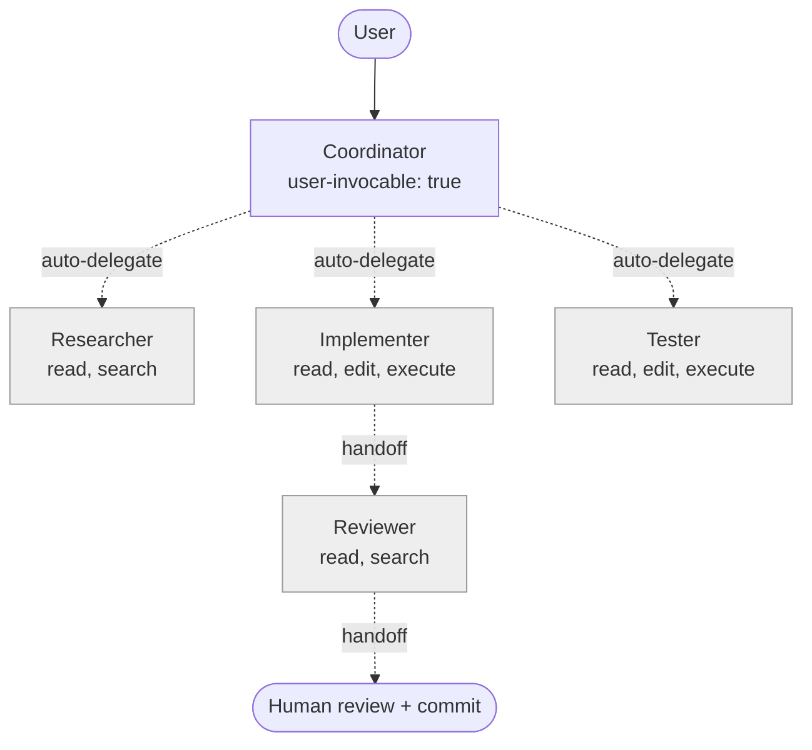
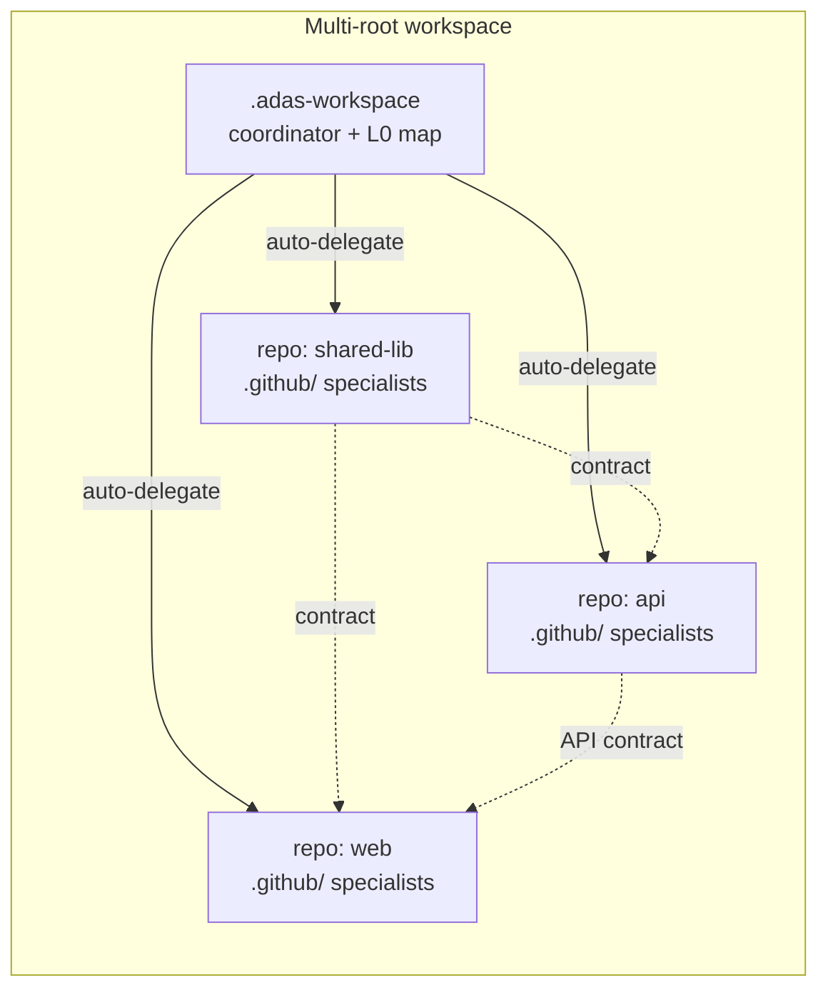
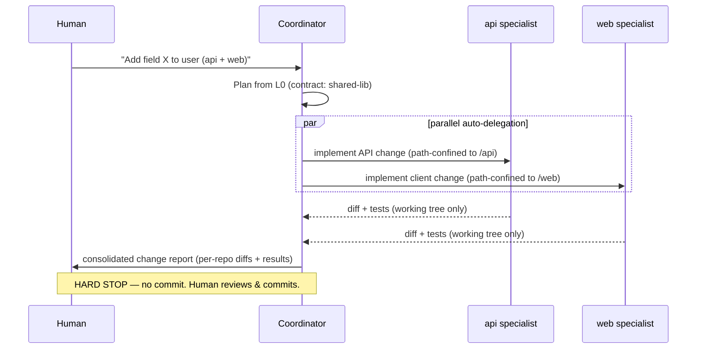
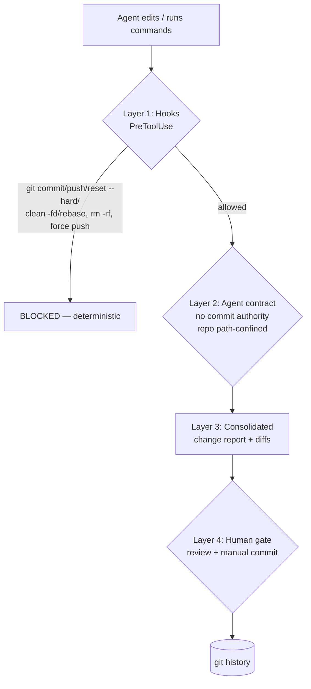

# ADAS Feature Spec — Tech-Agnostic, Multi-Repo, Auto-Delegated

Status: Draft (brainstorm consolidation)
Scope: Next evolution of ADAS — a meta-agent that scans repositories and generates an interconnected VS Code Copilot agent system.

This document captures the agreed design from the feature brainstorm. It is the source of truth for what to build next.

---

## 1. Goals

1. **Tech-agnostic generation** — ADAS must work on any language/stack, not just the two reference templates (typescript-react, python-fastapi).
2. **Agent-friendly context** — the scanner output must be a durable, structured artifact (text + mermaid) that generated agents can consume as grounding, not an ephemeral free-text report.
3. **Single-repo *and* multi-repo support** — the same scanner documents a lone repo, a monorepo, or a polyrepo (multiple independent repos in one multi-root workspace), and builds custom agents accordingly.
4. **Auto-delegated cross-repo execution** — a workspace coordinator delegates work to repo-scoped specialists in parallel, automatically.
5. **Strong guardrails** — autonomy stops at the working tree. **No automatic commits.** Nothing reaches git history without an explicit human action.

---

## 2. Core Principle — Separate Topology from Content

The reason ADAS currently leans toward two stacks is that stack-specific content is baked into templates. The fix is a clean separation:

| Concern | Stack-dependent? | Source |
|---|---|---|
| **Topology** — agent roles, handoff chains, subagent graph, tool sets | No | Universal roles (planner / implementer / reviewer / tester / coordinator) |
| **Content** — build/test/lint commands, `applyTo` globs, naming conventions, architecture, file patterns | Yes | **Scanner output only** — never pre-baked templates |

Consequences:
- The `templates/*` folders are demoted to **shape references** (they define the *structure* of an `.agent.md` / `.instructions.md`, not its language content).
- The scanner is the **single source of truth** for all content.
- Generation **fails fast** when a required signal is missing rather than emitting generic boilerplate.

### Capability detection instead of stack matching

Agents and skills are chosen by detected *capabilities*, independent of language:

| Detected capability | Generates |
|---|---|
| Test runner present | Tester agent + `run-tests` skill |
| Formatter/linter present | Implementer/Reviewer + `format` PostToolUse hook |
| CI/CD config present | Deployer agent + `deploy` skill |
| API surface (routes / OpenAPI / proto) | `api-patterns.instructions.md` |
| UI component framework | `component-patterns.instructions.md` |
| DB / migrations | `db-migrations` skill |

---

## 3. Orchestration Model

VS Code (as of the Feb–Jun 2026 docs) exposes **two distinct coordination mechanisms**. Good orchestration uses the right one per transition.

| Mechanism | Behavior | Use for |
|---|---|---|
| **Subagent delegation** | Lead calls a specialist that runs in **isolated context** and returns only its result; multiple can run **in parallel** | Autonomous fan-out — research, per-repo implementation, running tests |
| **Handoffs** | UI transition after a response; user clicks to move to next agent with a prefilled prompt (optionally `send: true`) | Deliberate **human checkpoints** |

### Two-tier topology

- **Coordinator** (`user-invocable: true`) — the only agent the user picks; plans and routes.
- **Specialists** (`user-invocable: false`) — researcher / implementer / reviewer / tester; reachable only as subagents or via handoff.
- Graph control via frontmatter: `agents: [allowlist]`, `disable-model-invocation`, minimal `tools:` per role.



Rule of thumb: **subagents for autonomous fan-out, handoffs for human-gated stage gates.** Adding subagent delegation (today ADAS models only handoffs) is the single biggest workflow upgrade.

---

## 4. Agent-Friendly Scanner Output

Two changes turn the scan from a one-shot input into reusable grounding.

### 4a. Persist the context

The scan is written to a durable artifact that generated agents reference via an always-on instruction:
- Single repo → `<repo>/.github/adas/context.md`
- Multi-repo → cached per-repo at `.adas-workspace/context/<repo>.context.md` plus the workspace map (§5).

### 4b. Hybrid format — structured text + mermaid

Mermaid is text-encoded (LLMs parse it well) yet renders visually in VS Code/GitHub preview. Use it **selectively** — diagrams for relationships, structured text/tables for facts.

| Diagram | Mermaid type | Captures |
|---|---|---|
| Architecture / module map | `flowchart` | layer & module dependencies |
| Request / data flow | `sequenceDiagram` | request lifecycle, auth flow |
| Build → test → deploy | `flowchart` | CI stages and gates |
| Generated agent topology | `flowchart` | handoff + subagent graph |

**Rule:** mermaid supplements, never replaces. Flat facts (commands, conventions, globs) stay as deterministic text/tables. Draw a diagram only when the information *is* a graph.

### Layered context model

```
L0  Workspace map      → repos present + cross-repo relationships   (multi-repo only)
L1  Per-repo context   → stack, conventions, commands, architecture (every repo)
L2  Concern detail     → feeds scoped .instructions.md
```

- **L1 is per-repo** → each repo's context is self-contained and works standalone.
- **L0 is workspace-level** → the cross-repo dependency graph and shared contracts.

---

## 5. Single-Repo and Multi-Repo Support

Three topologies the scanner must recognize:

| Topology | Definition | Output |
|---|---|---|
| **Single repo** | one repo | `<repo>/.github/` only |
| **Monorepo** | one git repo, many packages (turbo/nx/pnpm) | root `copilot-instructions.md` + package-scoped `.instructions.md` |
| **Polyrepo** | multiple independent repos in one multi-root workspace | per-repo `.github/` + workspace coordinator in `.adas-workspace/` |

Cross-repo relationships are detected **language-agnostically**: shared packages, OpenAPI/proto specs, env base-URLs, manifest references, resolved imports.

### `.adas-workspace/` layout

Added as a folder in the multi-root workspace, so it carries its **own `.github/`** for VS Code to discover its agents and hooks:

```
.adas-workspace/
├── .github/
│   ├── agents/
│   │   └── workspace-coordinator.agent.md   # user-invocable; agents: [repo specialists]; auto-delegates
│   └── hooks/
│       ├── block-git-write.json             # the no-commit guardrail (§7)
│       └── block-dangerous.json
└── context/
    ├── workspace-map.md                     # L0: cross-repo mermaid graph + contracts
    └── <repo>.context.md                    # cached per-repo L1
```

Each target repo still gets its own `.github/` and works on its own. The coordinator holds L0 and routes to repo-scoped specialists.



---

## 6. Auto-Delegated Cross-Repo Execution

The coordinator delegates to repo specialists **in parallel, partitioned by repo**. Polyrepo gives natural write-isolation — no two subagents touch the same file. The shared contract surface (types/specs) anchors the order when repos are interdependent.



---

## 7. Guardrails — Defense in Depth

Critical rule: **nothing reaches git history without an explicit human action.** Enforced at four levels so a single reasoning slip can't bypass it.



**Layer 1 — Hooks (deterministic, non-negotiable).** `block-git-write.json` (`PreToolUse`) hard-blocks any terminal command matching `git commit`, `git push`, `git reset --hard`, `git checkout -f`, `git clean -fd`, `git rebase`, or `git add` chained to a commit. Hooks run as code — agents can't reason around them. `block-dangerous.json` blocks `rm -rf`, force pushes, etc.

**Layer 2 — Agent contracts.** No generated agent (coordinator or specialist) has authority to commit; instructions state work **ends at a dirty working tree**. Each repo specialist is **path-confined to its own repo** — it cannot write into a sibling repo.

**Layer 3 — Coordination protocol.** After parallel delegation, the coordinator emits a **consolidated change report**: per-repo file list + diffs + test results, in one place.

**Layer 4 — Human gate at the commit boundary.** Execution is autonomous *up to* commit; the only human checkpoint is review-and-commit. The user commits manually (or via the platform's "Save to GitHub" feature).

Net effect: agents plan, edit, and test across multiple repos in parallel, but the working tree is always the stopping point — the human owns every commit.

### `block-git-write.json` (confirmed schema)

VS Code **ignores `matcher` at runtime**, so the hook registers a script and the *script* decides deny/allow from the stdin payload (Phase 0 finding). Config:

```json
{
  "hooks": {
    "PreToolUse": [
      { "type": "command", "command": "./scripts/block-git-write.sh", "timeout": 5 }
    ]
  }
}
```

`scripts/block-git-write.sh` reads the tool input from stdin, and if the command is a git-write (`commit`, `push`, `reset --hard`, `checkout -f`, `clean -fd`, `rebase`, or `add` chained to a commit) emits:

```json
{"hookSpecificOutput":{"hookEventName":"PreToolUse","permissionDecision":"deny","permissionDecisionReason":"ADAS guardrail: commits are human-gated. Review the consolidated change report and commit manually."}}
```

Otherwise it emits `"permissionDecision":"allow"`. Full script in `.github/skills/copilot-generation/references/hook-templates.md`.

---

## 8. Summary of Artifacts

| Artifact | Location | Stack-dependent | Notes |
|---|---|---|---|
| Workspace coordinator | `.adas-workspace/.github/agents/` | No (topology) | Auto-delegates to repo specialists |
| Guardrail hooks | `.adas-workspace/.github/hooks/` | No | Plus per-repo copies if used standalone |
| Workspace map (L0) | `.adas-workspace/context/workspace-map.md` | Yes (scan) | Cross-repo mermaid graph + contracts |
| Per-repo context (L1) | `<repo>/.github/adas/context.md` | Yes (scan) | Grounding for that repo's agents |
| Role agents | `<repo>/.github/agents/` | No (topology) | planner/implementer/reviewer/tester |
| Scoped instructions (L2) | `<repo>/.github/instructions/` | Yes (scan) | `applyTo` globs from real file patterns |
| Skills | `<repo>/.github/skills/` | Yes (commands) | Real detected commands, not placeholders |

---

## 9. Open Items / Next Steps

- [x] Confirm current VS Code hooks JSON schema before finalizing `block-git-write.json`. *(Phase 0: `matcher` is ignored at runtime; script-driven deny via `permissionDecision`. See `_research-notes.md`.)*
- [x] Define the machine-parseable section contract for `context.md` (stable headings the agents key off). *(Phase 0: see `_research-notes.md` and `context-templates.md`.)*
- [x] Specify the cross-repo contract detectors. *(analysis-checklist §9: shared packages, OpenAPI/proto/GraphQL, env base-URLs, resolved imports.)*
- [x] Decide whether the coordinator writes a review report file or renders in chat. *(Renders in chat; no auto-write, to avoid spurious working-tree changes the guardrail would flag.)*
- [x] Update `adas-scanner.agent.md` to emit the layered (L0/L1) + mermaid output.
- [x] Update `adas.agent.md` workflow to add subagent auto-delegation alongside handoffs.
- [x] Demote `templates/*` to shape references; remove stack-specific content from the generation path.

Remaining (future):
- [ ] Optional `--write-report` flag for a persisted workspace review report.
- [ ] Nested-subagent depth tuning once VS Code's setting stabilizes.
