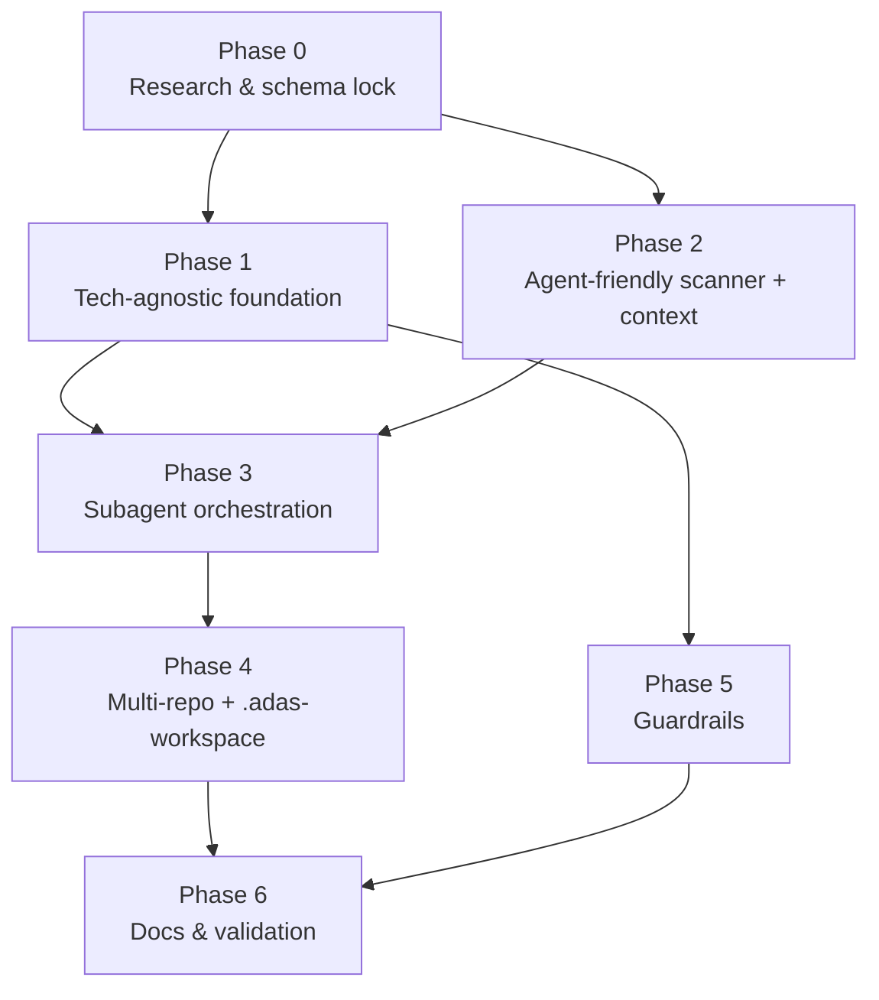

# ADAS Implementation Plan

Companion to [FEATURE_SPEC.md](./FEATURE_SPEC.md). This plan turns the spec into sequenced, file-level work. ADAS is a configuration system (Markdown + JSON), so "implementation" = editing the ADAS meta-agent files, skills, references, and adding new generation templates. No build/runtime.

> **Status (implemented):** Phases 0–6 complete. Tech-agnostic generation, agent-friendly context (L0/L1 + mermaid), subagent auto-delegation, `.adas-workspace/` polyrepo support, and the no-commit guardrail are all wired into the ADAS agents, skills, and reference templates. See `_research-notes.md` (schema lock) and `_validation.md` (dry-run scenarios). Remaining items are future/optional.

---

## Phase Dependency Graph

Phases 1 and 2 can proceed in parallel after Phase 0. Phase 5 depends only on Phase 1. Phase 4 needs the orchestration changes from Phase 3.

---

## Phase 0 — Research & Schema Lock (prerequisite)

Resolve the Open Items that block correct file generation. Read-only; no repo changes except a short findings note.

| # | Task | Output |
|---|---|---|
| 0.1 | Confirm current VS Code **hooks JSON schema** (event names, matcher, deny/action fields) | `block-git-write.json` shape locked |
| 0.2 | Confirm **subagent frontmatter** semantics: `user-invocable`, `disable-model-invocation`, `agents: [allowlist]`, parallel delegation, `model` | Orchestration frontmatter locked |
| 0.3 | Confirm **handoffs** frontmatter (`target`, `label`, `prompt`, `send`) | Handoff template locked |
| 0.4 | Define the **machine-parseable `context.md` section contract** — stable headings agents key off | `context.md` schema |

**Acceptance:** a short `docs/_research-notes.md` (or inline updates to the Open Items checklist) confirming each schema, with doc URLs.

---

## Phase 1 — Tech-Agnostic Foundation

Goal: remove stack bias; make the scanner the single source of truth; switch to capability detection.

| # | Task | Files |
|---|---|---|
| 1.1 | Add **topology vs content** principle to the generation skill | `.github/skills/copilot-generation/SKILL.md` |
| 1.2 | Replace stack-matching with a **capability-detection table** (test runner → Tester, formatter → format hook, CI → Deployer, API surface → api instructions, etc.) | `copilot-generation/SKILL.md` Step 1 |
| 1.3 | Add **fail-fast rule**: skip a file when its signal is absent rather than emitting boilerplate | `copilot-generation/SKILL.md` Quality Rules |
| 1.4 | Demote `templates/*` to **shape references** — README note + a `templates/README.md` clarifying they show *structure*, not stack content | `templates/README.md`, `README.md` |
| 1.5 | Audit `adas.agent.md` Phase 3 wording so agent/skill/instruction selection reads as capability-driven, not stack-driven | `.github/agents/adas.agent.md` |

**Acceptance:** running ADAS mentally against a Go or Rust repo selects correct agents/skills/instructions using only scan signals; no path emits TS/Python-specific text.

---

## Phase 2 — Agent-Friendly Scanner Output (context + mermaid)

Goal: persist the scan as durable grounding; emit structured text + selective mermaid; introduce the layered L0/L1/L2 model.

| # | Task | Files |
|---|---|---|
| 2.1 | Rewrite scanner output format to the **L1 `context.md` contract** from Phase 0.4 | `.github/agents/adas-scanner.agent.md`, `.github/skills/repo-analysis/SKILL.md` (Step 3) |
| 2.2 | Add **mermaid generation guidance** — when to draw (architecture/flow/pipeline/agent-topology) and when not to (flat facts) | `repo-analysis/SKILL.md`, `references/analysis-checklist.md` |
| 2.3 | Add a new **context template** reference (per-repo L1 doc skeleton with the stable headings + mermaid slots) | `.github/skills/copilot-generation/references/context-templates.md` (new) |
| 2.4 | Orchestrator persists scan to **`<repo>/.github/adas/context.md`** and wires an always-on instruction that references it | `.github/agents/adas.agent.md` (Phase 5 generation order), `copilot-generation/SKILL.md` |
| 2.5 | Generate a **`project-context.instructions.md`** (no `applyTo`, always-on) that points agents at `context.md` | `copilot-generation/references/instruction-templates.md` |

**Acceptance:** scan produces a `context.md` with parseable headings + ≥1 architecture mermaid; generated agents reference it.

---

## Phase 3 — Subagent Orchestration

Goal: add automatic subagent delegation alongside the existing handoff model.

| # | Task | Files |
|---|---|---|
| 3.1 | Update orchestrator workflow to describe **subagents (auto fan-out) vs handoffs (human gate)** and when to use each | `.github/agents/adas.agent.md` (Phase 3b) |
| 3.2 | Update **agent templates** with the locked frontmatter: `user-invocable`, `agents: [allowlist]`, `disable-model-invocation`, minimal `tools` | `copilot-generation/references/agent-templates.md` |
| 3.3 | Define the **coordinator-vs-specialist** pattern at single-repo scale (optional local coordinator for large repos) | `agent-templates.md`, `copilot-generation/SKILL.md` |
| 3.4 | Update verification checklist: validate `agents:` allowlist entries resolve to existing agents | `copilot-generation/SKILL.md` Step 4, `adas.agent.md` Phase 6 |

**Acceptance:** generated specialists are `user-invocable: false`; a coordinator's `agents:` list resolves to real agents; handoffs preserved for human checkpoints.

---

## Phase 4 — Multi-Repo Support + `.adas-workspace/`

Goal: detect workspace topology and generate the cross-repo layer.

| # | Task | Files |
|---|---|---|
| 4.1 | Add **topology detection** (single / monorepo / polyrepo) and cross-repo **contract detectors** (OpenAPI, proto, shared package graph, env base-URLs, resolved imports) to the scanner | `adas-scanner.agent.md`, `repo-analysis/references/analysis-checklist.md` |
| 4.2 | Add **L0 workspace-map** output: cross-repo mermaid graph + contract surface | `repo-analysis/SKILL.md`, new `copilot-generation/references/workspace-map-template.md` |
| 4.3 | Add **`.adas-workspace/` scaffolding** to the orchestrator: `.github/agents/`, `.github/hooks/`, `context/` | `adas.agent.md` (new multi-repo branch in Phase 5) |
| 4.4 | Add **workspace-coordinator** template (`user-invocable: true`, `agents: [repo specialists]`, auto-delegate, holds L0) | `copilot-generation/references/agent-templates.md` |
| 4.5 | Define **per-repo standalone guarantee** — each repo's `.github/` is complete on its own | `copilot-generation/SKILL.md` |
| 4.6 | Add **multi-root discovery note** — `.adas-workspace/` must be added as a workspace folder so VS Code discovers its `.github/` | `adas.agent.md`, `docs/USAGE.md` |

**Acceptance:** a polyrepo scan yields per-repo `.github/` + `.adas-workspace/` with a coordinator whose `agents:` resolve across repos, plus a workspace-map mermaid of cross-repo deps.

---

## Phase 5 — Guardrails (no auto-commit)

Goal: four-layer defense ensuring nothing reaches git history without a human action.

| # | Task | Files |
|---|---|---|
| 5.1 | **Layer 1 hooks**: `block-git-write.json` (PreToolUse, blocks commit/push/reset --hard/checkout -f/clean -fd/rebase + add→commit) and refresh `block-dangerous.json` | `copilot-generation/references/hook-templates.md`; generated into both `<repo>/.github/hooks/` and `.adas-workspace/.github/hooks/` |
| 5.2 | **Layer 2 contracts**: add "work ends at dirty working tree; no commit authority; repo path-confinement" clauses to implementer/coordinator agent templates | `agent-templates.md` |
| 5.3 | **Layer 3 protocol**: coordinator emits a **consolidated change report** (per-repo file list + diffs + test results) | `agent-templates.md` (coordinator), `adas.agent.md` |
| 5.4 | **Layer 4 gate**: human review-and-commit wording; point at the platform "Save to GitHub" flow | `agent-templates.md`, `docs/USAGE.md` |
| 5.5 | Add guardrail items to the **verification checklist** (hooks present, no agent has commit capability) | `copilot-generation/SKILL.md`, `adas.agent.md` Phase 6 |

**Acceptance:** every generated agent set ships the git-write hook; no agent's instructions permit committing; coordinator produces a review report and stops.

---

## Phase 6 — Docs & Validation

| # | Task | Files |
|---|---|---|
| 6.1 | Update **README** with tech-agnostic positioning, multi-repo + `.adas-workspace/`, auto-delegation, guardrails | `README.md` |
| 6.2 | Update **USAGE** with multi-root setup, what gets generated for polyrepo, commit-gate behavior | `docs/USAGE.md` |
| 6.3 | Add a **language-neutral reference template** (e.g., `templates/_shape/`) showing structure only | `templates/_shape/*` |
| 6.4 | **Dry-run validation** scenarios: walk ADAS mentally through (a) single Rust repo, (b) pnpm monorepo, (c) polyrepo web+api+shared-lib; confirm correct file sets | `docs/_validation.md` |
| 6.5 | Self-check pass against `adas.agent.md` Phase 6 checklist (cross-refs, frontmatter, guardrails) | n/a |

**Acceptance:** docs reflect new capabilities; all three dry-run scenarios produce valid, interconnected, guardrailed systems.

---

## Suggested Execution Order

1. **Phase 0** (unblocks everything)
2. **Phase 1 + Phase 2 in parallel**
3. **Phase 5** (can land right after Phase 1)
4. **Phase 3**
5. **Phase 4**
6. **Phase 6**

## Definition of Done (overall)

- [ ] No stack-specific content on the generation path; all content sourced from scan.
- [ ] Scanner emits durable `context.md` (text + selective mermaid), L0/L1/L2.
- [ ] Subagent auto-delegation + handoffs both supported; specialists hidden.
- [ ] Polyrepo produces per-repo `.github/` + `.adas-workspace/` coordinator with cross-repo map.
- [ ] Git-write guardrail hook on every generated set; no agent can commit; human owns commits.
- [ ] README + USAGE updated; three dry-run scenarios validated.
